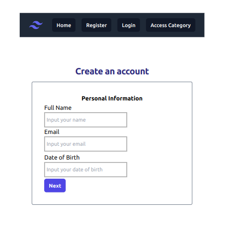
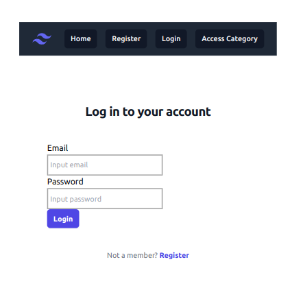
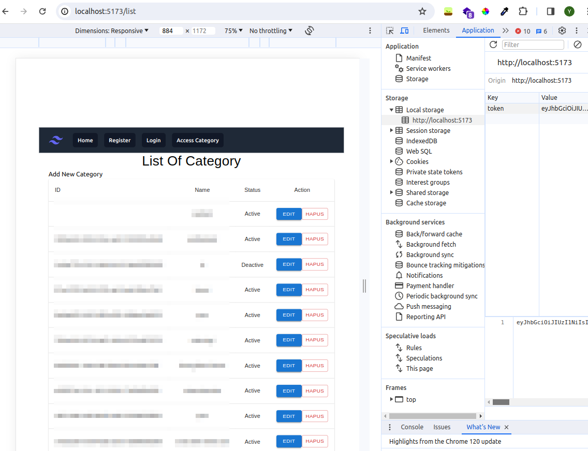

# Basic Login form using React, Formik, and Axios API  

## Deployed here:  

https://react-form.smmuja.com  

## Component  

- Public page  
Accessible by public, no authorization needed  
  - Registration page  

  

  - Login page  
  

- Private page  
Authorization needed, where user can perform authorized actions such as create, update, and delete  
  - Category page  
  

## Library and dependencies  

- React js  
- Vite  
- Formik  
- Yup  
- Tailwind  
- Axios  

## Deployment  

This form project is deployed at Netlify  
https://react-form.smmuja.com  
